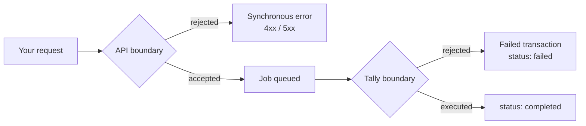

# Errors

## Two places things fail

This is the distinction that matters most, and it is easy to miss.



**Synchronous errors** happen at the API boundary. Bad credential, missing parameter, unauthorized company. You get an HTTP error immediately.

**Asynchronous failures** happen at the Tally boundary. The request was valid, the job ran, and Tally refused it. You get `success: true` first, and only discover the failure when you check the transaction.

An integration that only handles the first kind will appear to work and will silently lose writes.

## HTTP status codes

| Status | Meaning | Usual cause |
|---|---|---|
| `200` | Accepted or returned | For writes: queued, not completed |
| `400` | Bad request | Malformed payload, missing required field |
| `401` | Unauthenticated | Wrong or malformed credential |
| `403` | Unauthorized | Key valid, but not for this company |
| `404` | Not found | Wrong identifier, or a resource outside your scope |
| `422` | Validation failed | Payload well-formed but semantically invalid |
| `429` | Too many requests | Back off |
| `5xx` | Server error | Retry with backoff |

## `401` vs `403`

Worth separating, because the fixes are unrelated.

**`401`** — the credential itself. Check the header format is `Bearer {key_id}:{secret}`, with no trailing whitespace, and that the key has not been revoked.

**`403`** — the credential is fine, the *relationship* is not. Authorization requires `key → application → customer → company`. A `403` almost always means the company is not attached to a customer under your application, or you sent a `company_id` belonging to a different application.

Sending a Tally company GUID where `company_id` is expected also lands here.

## Failed transactions

```json
{
  "success": true,
  "status": "failed",
  "transaction_id": "11111111-1111-1111-1111-111111111111"
}
```

Note `success: true` alongside `status: "failed"` — the *query* succeeded; the *work* failed. Branch on `status`, not on `success`.

Common causes, in rough order of frequency:

| Cause | Fix |
|---|---|
| A named master does not exist | Create it, or correct the name. See [Masters](/developer/tally/masters). |
| Master name mismatch — case, trailing space | Match the company exactly |
| Statutory validation | Correct the `gst` block; check the company has GST enabled |
| Unbalanced entries | Debits and credits must net correctly |
| Voucher type not configured | The company has no such voucher type |
| Connector offline mid-job | Retry once it is back |

## Diagnosing in order

Work down this list rather than starting with the payload. The payload is usually the last thing wrong.

1. **`GET /api/v1/ping`** — is the credential valid?
2. **`GET /api/v1/companies/{id}/health`** — is the Connector online and Tally reachable?
3. **`GET /api/v1/connectors/{machine}/jobs`** — what has this connector actually been doing?
4. **`GET /api/v1/transactions/{id}`** — what did Tally say about this specific job?
5. **The payload** — do all named masters exist, exactly as written?

Most "the API is broken" reports resolve at step 2.

## Retry policy

| Failure | Retry? |
|---|---|
| `5xx`, `429` | Yes, exponential backoff with jitter |
| Network timeout on a write | **Poll first.** The job may have succeeded. |
| `401`, `403` | No. Fix the credential or provisioning. |
| `400`, `422` | No. Fix the payload. |
| Transaction failed on validation | No, not blindly. Fix the cause, then resubmit. |

That second row is the important one. A timeout tells you nothing about whether the work happened. Retrying immediately is how duplicate vouchers get created. Poll the transaction, and only resubmit if it genuinely is not there.

Never build an unbounded automatic retry against a validation failure. Tally rejected the payload once and will reject it identically forever, while generating noise in the customer's system and yours.

## What to log

- `transaction_id` for every write, before anything else.
- `key_id` — never the secret.
- `company_id`, and the request path.
- The full error response for failed transactions.

When a customer disputes something six months later, the raw response is what settles it.
