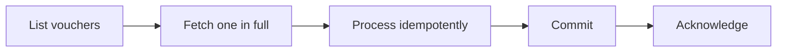

# Pull vouchers from Tally

This walkthrough lists Tally-originated vouchers, fetches one in full, processes it idempotently, and acknowledges it.

::: info Provisional fields
`status` values and `last_synced_at` are being finalized against production. The identifiers and overall structure are stable.
:::

## The flow



Acknowledgement comes **after** your commit. That ordering is the whole point of the queue.

## 1. List vouchers

```http
GET {{base_url}}/api/v1/pulled-vouchers?company_id={{company_id}}
Authorization: Bearer {{key_id}}:{{secret}}
Accept: application/json
```

Filters:

| Parameter | Purpose |
|---|---|
| `company_id` | Required. Bizmitra Developer Company ID. |
| `voucher_kind` | Normalized kind — `sales`, `purchase`, `receipt`, … |
| `voucher_type` | Exact Tally voucher-type name |
| `status` | Consumption status |
| `start_date`, `end_date` | Inclusive voucher-date window |
| `limit`, `offset` | Pagination |

Use `voucher_kind` for filtering. `voucher_type` is whatever the customer named it and varies between companies — see [Voucher kinds and types](/developer/tally/voucher-kinds).

```json
{
  "success": true,
  "count": 1,
  "total": 1,
  "limit": 50,
  "offset": 0,
  "invoices": [
    {
      "bizmitra_company_id": 123,
      "transaction_id": "00000000-0000-0000-0000-000000000001",
      "tally_voucher_guid": "00000000-0000-0000-0000-000000000001-00000001",
      "tally_master_id": "334",
      "tally_alter_id": 1254,
      "voucher_date": "20260601",
      "voucher_kind": "sales",
      "voucher_type": "Sales",
      "voucher_number": "INV-DEMO-001",
      "status": "pulled",
      "last_synced_at": null
    }
  ]
}
```

Two things to notice:

**`invoices` is a historical wire name.** It contains any voucher kind — purchases arrive here too.

**Respect `total`, `limit`, and `offset`.** One page is not all the vouchers. A company with three years of history has tens of thousands.

## 2. Fetch one voucher

```http
GET {{base_url}}/api/v1/pulled-vouchers/{{transaction_id}}?company_id={{company_id}}
Authorization: Bearer {{key_id}}:{{secret}}
Accept: application/json
```

```json
{
  "success": true,
  "invoice": {
    "bizmitra_company_id": 123,
    "transaction_id": "00000000-0000-0000-0000-000000000001",
    "voucher_kind": "sales",
    "voucher_type": "Sales",
    "voucher_number": "INV-DEMO-001",
    "invoice_json": {
      "date": "2026-06-01",
      "party_ledger": "Example Customer",
      "vch_entry_mode": "Item Invoice",
      "buyer": {
        "name": "Example Customer",
        "mailing_name": "Example Customer Pvt Ltd",
        "address": ["1st Road", "2nd Road"],
        "pincode": "444444",
        "country": "India"
      },
      "consignee": {
        "name": "Example Warehouse",
        "address": [],
        "pincode": "382110",
        "state": "Gujarat",
        "country": "India",
        "gstin": "24BBBBB0000B1Z5"
      },
      "dispatch": {
        "doc_no": "DC-9",
        "date": "2026-06-01",
        "through": "Blue Dart",
        "destination": "Ahmedabad",
        "place_of_receipt": "Gandhinagar",
        "vessel_flight_no": null,
        "order_reference": null,
        "payment_terms": "30 Days",
        "delivery_note_no": "DN-3",
        "delivery_note_date": "2026-05-31"
      },
      "inventory_entries": [
        {
          "stock_item": "Example Item",
          "qty": 100,
          "rate": 12,
          "amount": 1200,
          "unit": "Nos"
        }
      ],
      "totals": {
        "taxable": 1200,
        "tax": 216,
        "invoice_total": 1416
      }
    }
  }
}
```

The list gives you metadata; the detail gives you `invoice_json`, the normalized document. See [Data model](/developer/platform-concepts/data-model).

### Bill-to, ship-to and dispatch

`buyer`, `consignee` and `dispatch` use the **same field names the push side accepts**, so a voucher read out of Tally can be written back without remapping — read [the push reference](/developer/examples/push-invoice#bill-to-ship-to-and-dispatch) for what each field means.

::: warning Each block is `null`, not empty, when the voucher has no such data
Most vouchers carry none of this, and a journal or a payment never will. Test the block itself — `if (v.consignee)` — rather than reaching into `v.consignee.state` and finding `undefined`. `buyer` is the exception that is usually present: its `name` falls back to the party ledger, so a voucher with no separate bill-to still returns a `buyer` whose `address` is an empty array.
:::

`consignee.state` is the **delivery** state and is independent of the buyer's state in `gst`. On a "bill to one state, deliver to another" sale the two differ, and that difference is the whole reason to read this block rather than assuming the buyer's address.

`dispatch.delivery_note_no` is the delivery note the invoice was raised against. Tally stores it nested in its own block rather than as a plain voucher field, which is why it appears here and not under `reference`.

`consignee.address` comes back as an empty array. Tally does not hold consignee street lines on the voucher — they live in the party ledger's address book, referenced by id — so there is nothing to return. The field is kept so the block matches the push shape; read the ship-to street address from the ledger master instead.

### Which bills a voucher opened or settled

Ledger entries carry `bill_allocations` — the bill-wise references Tally keeps against the party. This is how you reconstruct who owes what: an invoice reports the bill it opened, a receipt or payment reports the bills it cleared.

```json
"ledger_entries": [
  {
    "ledger_name": "Acme Pvt Ltd", "amount": 10000, "is_debit": false, "is_party": true,
    "bill_allocations": [
      { "name": "Bm/26-27/1", "bill_type": "Agst Ref", "amount": 5000 },
      { "name": "Bm/26-27/2", "bill_type": "Agst Ref", "amount": 5000 }
    ]
  }
]
```

`bill_type` is `New Ref` when the voucher opened the bill and `Agst Ref` when it settled one, with `Advance` and `On Account` for the remaining two cases. A single line can settle several bills, which is why it is a list.

::: warning `amount` carries Tally's sign
The allocation takes the same sign as the ledger line it sits on — positive on a receipt's credited party line, negative on a sales invoice's debited one. Take the absolute value if you are summing settlements, and do not read the sign as "credit note".

The push side ignores the sign entirely and re-derives it from the line, so a pulled voucher still pushes back unchanged.
:::

A line with no bill-wise data returns `[]`, never a list of nulls — Tally pads most party lines with an empty block and those are dropped. Bills whose party ledger does not keep balances bill-by-bill have no allocations at all, which is a configuration fact about that ledger rather than missing data.

There is no credit-period or due-date field: Tally exports the tag blank even for a bill that has one. Read due dates from the ledger's outstanding report instead.

### Telling an item invoice from an accounting one

`vch_entry_mode` carries Tally's own value verbatim — `"Item Invoice"` or `"Accounting Invoice"` — and is `null` on kinds that have no such mode (journals, receipts, payments). It is there for audit and cross-checking.

::: warning Classify on `inventory_entries`, not on the inventory block
Tally exports an **empty** inventory block on an accounting invoice rather than omitting it. Code that asks "does this voucher have an inventory section?" will call every accounting invoice an item invoice.

Ask whether `inventory_entries` has any lines. That is the same question Bizmitra asks when building a voucher in the other direction, so the two stay consistent.
:::

## 3. Process idempotently

Use `transaction_id` as the external key on your own record.

```js
async function ingest(voucher) {
  const existing = await db.vouchers.findByExternalId(voucher.transaction_id)

  if (existing) {
    // Seen before. Update if Tally's alter id moved; otherwise ignore.
    if (voucher.tally_alter_id > existing.tally_alter_id) {
      await db.vouchers.update(existing.id, mapFrom(voucher))
    }
    return existing.id
  }

  return db.vouchers.insert({
    external_id: voucher.transaction_id,
    tally_voucher_guid: voucher.tally_voucher_guid,
    tally_alter_id: voucher.tally_alter_id,
    ...mapFrom(voucher),
  })
}
```

`tally_alter_id` increments when a voucher is edited in Tally. Comparing it is how you tell a genuine update from a redelivery of something you already have.

Never key on `voucher_number`. Tally's numbering is configured per voucher type per company, can restart annually, and is not guaranteed unique.

## 4. Acknowledge

```http
POST {{base_url}}/api/v1/pulled-vouchers/ack
Authorization: Bearer {{key_id}}:{{secret}}
Content-Type: application/json
```

Acknowledgement moves processed vouchers out of the default pending queue. It is idempotent, so acknowledging twice is harmless.

::: warning Acknowledge after your commit, never before
If you acknowledge first and your own transaction then fails, the voucher has left the pending queue and your database does not have it. You will not see it again in the default query.

Order: process → commit → acknowledge.
:::

## Putting it together

```js
async function sync(companyId) {
  let offset = 0
  const limit = 100

  for (;;) {
    const page = await api.get('/api/v1/pulled-vouchers', {
      company_id: companyId, status: 'pulled', limit, offset,
    })

    for (const summary of page.invoices) {
      const { invoice } = await api.get(
        `/api/v1/pulled-vouchers/${summary.transaction_id}`,
        { company_id: companyId },
      )

      await db.transaction(async () => {
        await ingest({ ...summary, ...invoice })
      })

      await api.post('/api/v1/pulled-vouchers/ack', {
        company_id: companyId,
        transaction_id: summary.transaction_id,
      })
    }

    offset += limit
    if (offset >= page.total) break
  }
}
```

## Moving off polling

Keep this poll → fetch → acknowledge loop as the primary way to receive vouchers. Webhooks currently cover Connector, Tally, and company-presence events only; they do not notify you when a voucher arrives.
