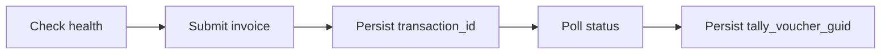

# Create an invoice in Tally

This walkthrough submits a normalized sales invoice and verifies the final Tally result.

::: warning Use a test company
Writes are real and there is no undo. Run this against a dedicated Tally test company.
:::

## The flow



Step 3 before step 4. If your process dies between submitting and persisting, you have made a write you can no longer track — and retrying blind is how duplicates appear.

## 0. Check health first

```http
GET {{base_url}}/api/v1/companies/{{company_id}}/health
```

One cheap request that removes an entire category of confusing failure. See [Company health](/developer/tally/company-health).

## 1. Submit

```http
POST {{base_url}}/api/v1/invoices
Authorization: Bearer {{key_id}}:{{secret}}
X-Bizmitra-Company: {{company_id}}
Accept: application/json
Content-Type: application/json
```

```json
{
  "event_type": "invoice_create",
  "request_type": "in",
  "invoice": {
    "voucher_type": "Sales",
    "voucher_number": "INV-DEMO-002",
    "date": "2026-06-01",
    "reference": "PO-DEMO-001",
    "party_ledger": "Example Customer",
    "gst": {
      "registration_type": "Regular",
      "place_of_supply": "Gujarat",
      "state": "Gujarat",
      "party_gstin": "24AAAAA0000A1Z5"
    },
    "inventory_entries": [
      {
        "stock_item": "Example Item",
        "qty": 100,
        "rate": 12,
        "amount": 1200,
        "unit": "Nos",
        "godown": "Main Location",
        "hsn": "33345",
        "taxability": "Taxable",
        "gst_rates": [
          { "duty_head": "CGST", "rate": 9 },
          { "duty_head": "SGST/UTGST", "rate": 9 }
        ],
        "accounting_allocations": [
          { "ledger_name": "Sales", "amount": 1200 }
        ]
      }
    ],
    "ledger_entries": [
      { "ledger_name": "Example Customer", "amount": -1416, "is_party": true },
      { "ledger_name": "CGST", "amount": 108, "is_tax": true },
      { "ledger_name": "SGST", "amount": 108, "is_tax": true }
    ]
  }
}
```

### What the payload is doing

**`inventory_entries`** — what moved. The `accounting_allocations` inside each line say which revenue ledger that line's value lands in.

**`ledger_entries`** — the double-entry effect, with signed amounts. The party is negative; the tax ledgers are positive. These signs are the debits and credits — reversing one posts the opposite transaction.

**`gst`** — the statutory context. `place_of_supply` against the company's own state decides whether tax splits into CGST + SGST or becomes a single IGST line. Same goods, same value, different ledgers.

**Every name must exist.** `Example Customer`, `Example Item`, `Nos`, `Main Location`, `Sales`, `CGST`, `SGST` must all exist in the target company, matching exactly. This is the most common cause of a first write failing. See [Masters](/developer/tally/masters).

## 2. Retain the transaction

```json
{
  "success": true,
  "transaction_id": "11111111-1111-1111-1111-111111111111",
  "company_id": 123,
  "request_type": "in"
}
```

::: danger This is not proof the voucher exists
`success: true` means Bizmitra accepted and queued the request. Tally has not necessarily run yet, and when it does it may reject the voucher.

Persist `transaction_id` against your record now, before anything else.
:::

## 3. Verify the result

```http
GET {{base_url}}/api/v1/transactions/{{transaction_id}}
```

```json
{
  "success": true,
  "status": "completed",
  "transaction_id": "11111111-1111-1111-1111-111111111111",
  "tally_voucher_guid": "22222222-2222-2222-2222-222222222222-00000001",
  "tally_master_id": "335"
}
```

::: info Provisional envelope
This is the intended contract, being finalized against production. A successful result will always expose `transaction_id` and the Tally voucher GUID.
:::

Poll with backoff — a couple of seconds initially, widening. Better still, use [webhooks](/developer/webhooks/) and poll only as a fallback.

**Persist `tally_voucher_guid`.** Without it, a later update has no way to target the existing voucher and will create a second one.

## 4. Handle failure

```json
{
  "success": true,
  "status": "failed",
  "transaction_id": "11111111-1111-1111-1111-111111111111"
}
```

Note `success: true` with `status: "failed"` — the query succeeded, the work did not. Branch on `status`.

| Cause | Fix |
|---|---|
| A named master does not exist | Create it, or correct the name |
| Name mismatch — case, trailing space | Match the company exactly |
| GST validation | Check the `gst` block and that the company has GST enabled |
| Unbalanced entries | Debits and credits must net correctly |
| Voucher type not configured | The company has no such type |

Do not retry a validation failure automatically. Tally rejected it once and will reject it identically forever.

## Putting it together

```js
async function pushInvoice(record, companyId) {
  // Already submitted? Poll, do not resubmit.
  if (record.transaction_id) {
    return pollUntilSettled(record.transaction_id)
  }

  const health = await api.get(`/api/v1/companies/${companyId}/health`)
  if (!health.ready) throw new ConnectorUnavailable(health)

  let accepted
  try {
    accepted = await api.post('/api/v1/invoices', buildPayload(record), {
      headers: { 'X-Bizmitra-Company': companyId },
    })
  } catch (err) {
    // Ambiguous failure: the job may have been created. Never blind-retry.
    if (isTimeout(err)) throw new NeedsReconciliation(record.id)
    throw err
  }

  await db.records.update(record.id, { transaction_id: accepted.transaction_id })

  const result = await pollUntilSettled(accepted.transaction_id)

  if (result.status === 'completed') {
    await db.records.update(record.id, {
      tally_voucher_guid: result.tally_voucher_guid,
      synced_at: result.completed_at,
    })
  }

  return result
}
```

The two lines that matter most are the early return at the top and the timeout branch. Together they are the reason this function cannot create a duplicate voucher.

## Updating an invoice later

Target the stored `tally_voucher_guid`. An update that identifies the voucher by number or by party name will not find it reliably, and will create a second voucher instead of amending the first.
