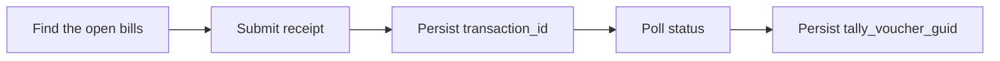

# Settle invoices with a receipt

This walkthrough records money received against the specific invoices it pays, so the customer's outstanding report moves.

::: warning Use a test company
Writes are real and there is no undo. Run this against a dedicated Tally test company.
:::

## Why this is not just a receipt

A receipt that moves ₹10,000 from a customer into cash is two facts, not one.

The first is the money: cash up ten thousand, the customer's ledger down ten thousand. Post only that and Tally accepts it, the day book shows it, and the ledger balance is right.

The second is **which invoices it paid** — and Tally will not infer it. Without it the amount sits unallocated, and Bills Outstanding still lists every invoice as open. Nothing errors. The first person to notice is whoever chases the debtors, and by then there are hundreds of them.

That second fact is `bill_allocations`.

## The flow



## 0. Know which bills are open

An allocation names a bill. The name must match a bill **actually outstanding for that party** in Tally — it is a reference to an existing record, not free text you invent.

In practice you already hold it: it is the `voucher_number` of the invoice you pushed, which Tally used as the bill reference when it opened the bill. If you did not push the invoice, read it back from the pulled voucher — an invoice that opened a bill carries it under `bill_allocations` with `bill_type: "New Ref"`.

Send a name Tally cannot find and it does not post a partial voucher: it parks the whole thing as an import exception.

## 1. Submit

```http
POST {{base_url}}/api/v1/receipts
Authorization: Bearer {{key_id}}:{{secret}}
X-Bizmitra-Company: {{company_id}}
Accept: application/json
Content-Type: application/json
```

```json
{
  "event_type": "receipt_create",
  "request_type": "in",
  "voucher": {
    "voucher_type": "Receipt",
    "voucher_number": "1",
    "date": "2026-04-01",
    "party_ledger": "Acme Pvt Ltd",
    "narration": "Part payment, two invoices",
    "ledger_entries": [
      { "ledger_name": "Cash", "amount": 10000, "is_debit": true },
      {
        "ledger_name": "Acme Pvt Ltd", "amount": 10000, "is_debit": false, "is_party": true,
        "bill_allocations": [
          { "name": "Bm/26-27/1", "bill_type": "Agst Ref", "amount": 5000 },
          { "name": "Bm/26-27/2", "bill_type": "Agst Ref", "amount": 5000 }
        ]
      }
    ]
  }
}
```

**`ledger_entries`** is the money, and `is_debit` carries the direction per line — cash debited, the customer credited. A receipt has no inventory block.

**`bill_allocations`** goes on the **party** line, never the cash line. The bank or cash side of a receipt has no bills; it is where `bank_allocations` goes if you are recording a cheque.

The allocations should add up to the line. Tally does not object to a shortfall — it leaves the remainder unallocated, which is the same silent failure as omitting the block, just smaller.

### Settling one bill in full

The common case needs almost nothing. One allocation with no amount takes the whole line:

```json
"bill_allocations": [{ "name": "Bm/26-27/1" }]
```

`bill_type` defaults to `Agst Ref` when you give a name, so this reads as "this receipt clears that invoice". The amount is only required when a line is split across several bills, where guessing a split would be worse than refusing one.

### The four reference types

| `bill_type` | Use when |
|---|---|
| `Agst Ref` | Settling an invoice that already exists. The default when a `name` is given |
| `New Ref` | Opening a new bill — what a sales or purchase voucher does |
| `Advance` | Money taken before the invoice exists |
| `On Account` | Deliberately unallocated. The only type with no `name` |

`On Account` is worth using deliberately rather than by omission. Both leave the money unallocated, but one of them says you meant it.

::: tip Payments work identically
`POST /api/v1/payments` takes the same `bill_allocations` on the supplier line, settling purchase bills instead of sales ones. The direction lives in `is_debit`, not in the shape.

A line may carry both lists: `bank_allocations` says how the money moved (cheque number, UTR), `bill_allocations` says which bills it cleared. They answer different questions and neither implies the other.
:::

::: warning No credit period or due date
There is no field for a bill's credit period. Tally accepts one on import, reports no error, and ignores it — and it does not export the value on the voucher either. Rather than offer a key that quietly does nothing, the payload omits it. Set due dates in Tally.
:::

## 2. Retain the transaction

```json
{
  "success": true,
  "transaction_id": "11111111-1111-1111-1111-111111111111",
  "company_id": 123,
  "voucher_type": "Receipt",
  "job_type": "receipt_sync",
  "request_type": "in"
}
```

::: danger This is not proof the receipt exists
`success: true` means Bizmitra queued the request. Tally has not run yet, and a bad bill name is rejected at that point, not this one.

Persist `transaction_id` against your record now, before anything else.
:::

## 3. Verify the result

Poll the transaction until it settles, exactly as in [Create an invoice in Tally](/developer/examples/push-invoice#_3-verify-the-result), and persist `tally_voucher_guid`.

A receipt whose allocations Tally could not match fails **here**, not at submission — which is the whole reason step 3 is not optional.

## 4. Confirm the allocation landed

The ledger balance moving is not evidence the allocation worked; that happens either way. Pull the voucher back and read the party line:

```json
"bill_allocations": [
  { "name": "Bm/26-27/1", "bill_type": "Agst Ref", "amount": 5000 },
  { "name": "Bm/26-27/2", "bill_type": "Agst Ref", "amount": 5000 }
]
```

Same field name, same shape as you sent — so a pulled voucher can be pushed back unchanged. Note that pulled amounts carry Tally's sign, matching the ledger line they hang off: positive on a receipt's credited party line, negative on a sales invoice's debited one. On the way in the sign is ignored and taken from the line, so a round-trip needs no correction.

## Related

- [Data model — bill-wise allocations](/developer/platform-concepts/data-model#bill-wise-allocations) — the field rules
- [Voucher kinds](/developer/tally/voucher-kinds) — which kinds carry what
- [Pull vouchers from Tally](/developer/examples/pull-vouchers) — reading them back
