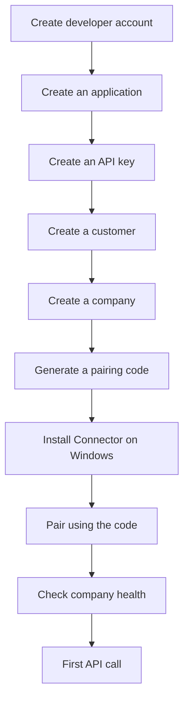

# Getting Started

This section takes you from nothing to a verified request against a real Tally company.

Budget about an hour for the first pass. Most of that is not code — it is getting a Windows machine with TallyPrime into a state where it can be paired.

## What you need

1. A Bizmitra developer account.
2. An **application** and an **API key** created under it.
3. A **customer** and a **company** created for testing.
4. The **Connector App** installed and paired on a Windows computer that can reach TallyPrime.
5. The **Developer Company ID** returned by Bizmitra.

::: warning The Developer Company ID is not a Tally GUID
`company_id` throughout this documentation means the Bizmitra Developer Company ID — an integer Bizmitra assigns. It is not the Tally company GUID, and the two are not interchangeable. Passing a Tally GUID where `company_id` is expected fails authorization rather than returning an empty result.
:::

## The order things happen in

Steps 1 through 5 can all be done through the API rather than the Bizmitra portal. That matters if you are embedding provisioning in your own product — see [Applications](/developer/platform-concepts/applications).

## Pages in this section

- **[Create a developer account](/developer/getting-started/registration)** — registration, applications, and API keys.
- **[Sandbox and test data](/developer/getting-started/sandbox)** — how to test safely, and why you should use a dedicated Tally company.
- **[Your first request](/developer/getting-started/first-request)** — ping, health check, and reading real data.

## Before you write any code

Use a dedicated Tally **test company**, not a customer's live books. Writes to Tally are real writes. A malformed invoice in a live company is a bookkeeping problem for somebody, and Bizmitra cannot undo it for you.

Never commit `key_id`, `secret`, pairing codes, webhook secrets, or customer identifiers to source control. See [Security](/developer/production/security).
