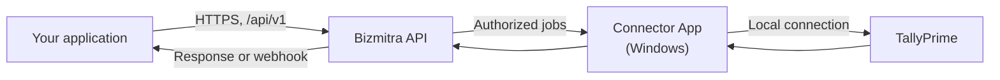

# Developer Platform

Bizmitra gives your application a single, normalized way to read and write a customer's business data — starting with TallyPrime — without asking that customer to expose their accounting software to the internet.

::: info Public preview
The platform is in public preview. Endpoints under `/api/v1` are stable in shape, but some response fields are still being finalized. Pages that describe a provisional contract say so explicitly.
:::

## What problem this solves

Connecting to accounting software is rarely a networking problem. It is a domain problem.

A developer integrating an order system with an accounting package has to answer questions that have nothing to do with their product: which ledger does this line hit, what does place of supply do to the tax split, what makes a credit note valid, why did the same invoice arrive twice, and what happens when the customer renamed a voucher type three years ago.

Bizmitra absorbs that layer. You send a normalized document; Bizmitra resolves it against the target company's actual masters and statutory configuration, and reports back a result you can reconcile against.

The same reasoning applies in reverse. Reading data out of accounting software and into your product means understanding what you were given, not just parsing it.

## What you can build

- **Product-to-accounting sync** — push invoices, orders, credit and debit notes, purchases, receipts, payments, contras, and journals into a customer's Tally company.
- **Accounting-to-product sync** — pull vouchers that originated in Tally, with a normalized representation and an acknowledgement queue so you process each one exactly once.
- **Reporting surfaces** — read stock summaries, stock movement, funds flow, profit and loss, and TDS data without building Tally report parsing yourself.
- **Embedded provisioning** — create customers, companies, and pairing codes through the API so your users never see a Bizmitra screen.
- **Event-driven workflows** — subscribe to webhooks instead of polling.

## How the pieces fit

Four things are always involved:

1. **Your application** — holds the business workflow and the source records.
2. **The Bizmitra API** — authenticates you, authorizes the application–customer–company relationship, and routes work.
3. **The Connector App** — an installed Windows component that collects authorized work and talks to Tally over the local network.
4. **TallyPrime** — the system of record for the accounting data.

Tally never needs a public address. The Connector reaches out to Bizmitra, not the other way around.

## Start here

| Step | Page |
|---|---|
| 1. Get an account, an application, and an API key | [Getting Started](/developer/getting-started/) |
| 2. Understand applications, customers, companies, and jobs | [Platform Concepts](/developer/platform-concepts/) |
| 3. Learn how the Tally side actually behaves | [Tally](/developer/tally/) |
| 4. Authenticate and call the API | [API](/developer/api/) |
| 5. Replace polling with events | [Webhooks](/developer/webhooks/) |
| 6. Harden the integration before launch | [Production](/developer/production/) |
| 7. Copy a working end-to-end flow | [Examples](/developer/examples/) |

## Coming to these docs

Three sections are planned but not yet published. They are listed here so you can see the intended shape of the platform:

- **Connectors** — building and distributing your own branded Connector, and the connector lifecycle API in depth.
- **Building Integrations** — patterns for connecting Bizmitra to a third-party service on behalf of many customers.
- **Migrations** — moving a customer's data between two systems, with Bizmitra as the intermediate representation.

If you are blocked on one of these today, [contact Bizmitra](https://bizmitra.io/contact) — the underlying APIs exist ahead of the documentation.
