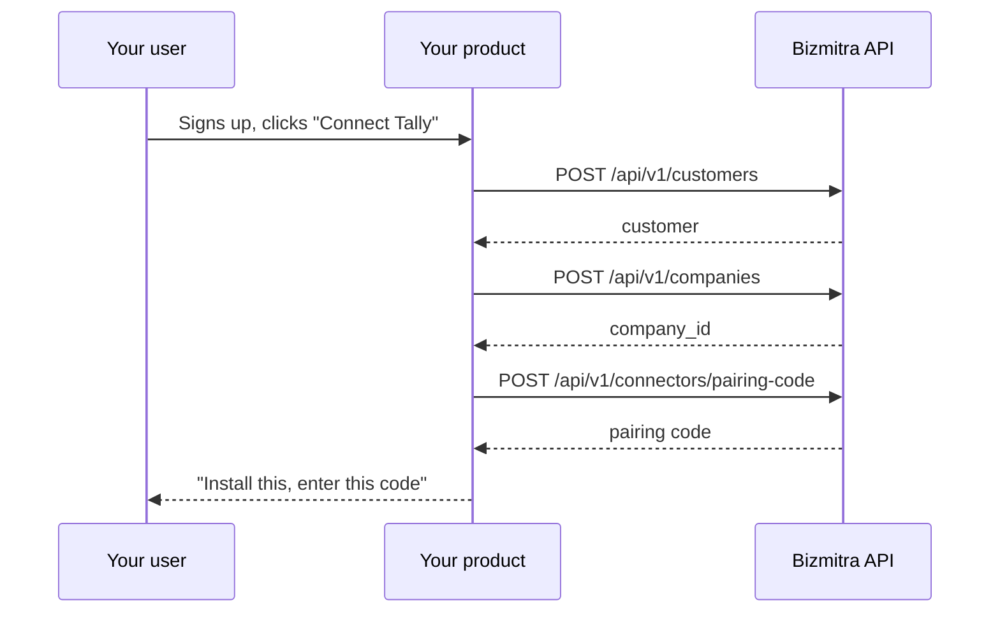

# Applications

An **application** is one product you are integrating with Bizmitra. It is the unit that owns credentials, customers, and Connector branding.

```http
GET /api/v1/applications
Authorization: Bearer {key_id}:{secret}
```

## What an application owns

| It owns | Consequence |
|---|---|
| API keys | A key acts on behalf of exactly one application |
| Customers | Customers are scoped to the application that created them |
| Connector branding | The generated Connector carries the application's identity |
| Webhook endpoints | Events are delivered per application |

## One application or several?

Create **one application per product**, not per customer and not per environment.

- Two distinct products your company sells → two applications.
- One product with 5,000 customers → one application, 5,000 customers.
- Development and production → **one** application, two API keys.

The instinct to separate environments into separate applications is understandable but works against you: customers and companies created under a development application are not visible to a production one, so you cannot promote a tested setup — you have to rebuild it.

## Branded Connectors

An application can have a Connector App generated for it. Your customers install something that carries your product's name, not a third-party tool they have to be persuaded to trust.

This matters more than it sounds. Asking a business to install unfamiliar Windows software next to their accounting system is a real point of friction in onboarding, and branding removes a large part of it.

Generation and distribution are covered in the **Connectors** section, which is not yet published. [Contact Bizmitra](https://bizmitra.io/contact) if you need it now.

## Embedded provisioning

Everything an application can do through the Bizmitra portal, it can do through the API. That lets you keep your users entirely inside your own product:



The user sees your onboarding. They never visit a Bizmitra screen. The only unavoidably local step is installing and pairing the Connector, because it runs on their machine.

This is the intended shape for any partner with more than a handful of customers. Manual provisioning through the portal is fine for your first few; it does not survive scale.

## Keys per application

An application can hold several keys at once, which is what makes rotation safe:

1. Create a new key.
2. Deploy it.
3. Confirm traffic has moved.
4. Revoke the old one.

No window where the integration is down. See [Authentication](/developer/api/authentication).
