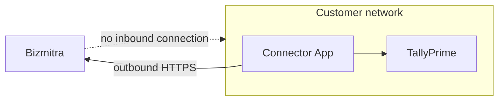
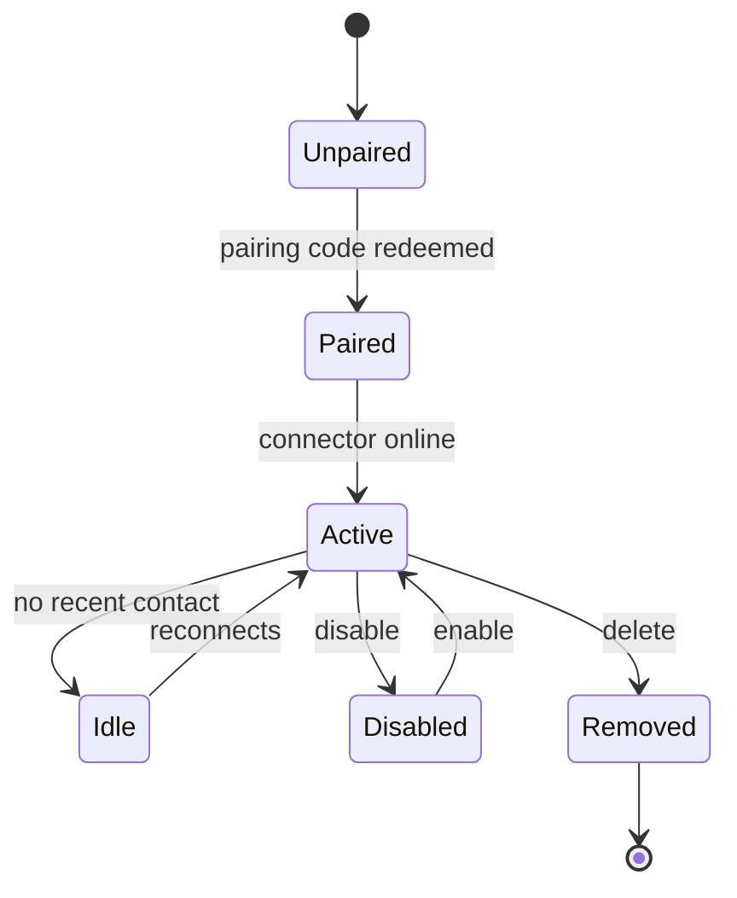

# Connectors

A **Connector** is the installed Windows agent that carries authorized work between Bizmitra and a locally accessible TallyPrime instance.

It is a component of your integration, not a standalone product a customer can buy and use on its own. It requires an application, a paired company, and a developer account behind it.

## Why it exists

TallyPrime is desktop software running inside a business's own network. It has no public endpoint, and exposing one would be a poor idea even where it is technically possible.

The Connector inverts the direction. It sits next to Tally, reaches **out** to Bizmitra over HTTPS, collects work it is authorized to do, executes it locally, and reports back.



No inbound firewall rule. No port forwarding. No static IP. The customer's network stays closed.

## The fleet problem

One Connector serves one machine. A partner with 400 customers is operating a fleet of roughly 400 Windows installations they do not own, cannot log into, and cannot reboot.

The connector API exists because of that:

```http
GET    /api/v1/connectors                        # list the fleet
GET    /api/v1/connectors/{machine}              # one connector
GET    /api/v1/connectors/{machine}/companies    # what it serves
GET    /api/v1/connectors/{machine}/jobs         # sync history
PATCH  /api/v1/connectors/{machine}              # rename
POST   /api/v1/connectors/{machine}/disable      # stop it taking work
POST   /api/v1/connectors/{machine}/enable       # resume
DELETE /api/v1/connectors/{machine}              # remove
```

Build a support view over these early. When a customer says "it stopped working", the answer is almost always visible in the connector list and its job history — the machine went offline, Tally was closed, or the connector was disabled during an office move.

## Lifecycle



**Disable** is reversible and keeps the pairing. Use it during maintenance, or when a customer is in a billing dispute and you want writes to stop without tearing down their setup.

**Delete** removes the connector. The customer has to install and pair again.

## Renaming

```http
PATCH /api/v1/connectors/{machine}
```

Default machine names are not useful at scale. `DESKTOP-4F9J2K1` tells you nothing when a support ticket arrives; `Acme Ltd — Accounts PC` tells you everything. Rename connectors as part of onboarding.

## Pairing codes

Pairing is code-based rather than credential-based, so a customer never handles your API secret:

```http
POST /api/v1/connectors/pairing-code               # generate
GET  /api/v1/connectors/pairing-codes              # list outstanding
POST /api/v1/connectors/pairing-codes/{id}/revoke  # revoke
```

Codes are short-lived and single-purpose. Revoke any that were issued and not used — an unredeemed code sitting in an old email is a loose end.

Walkthrough in [Pairing a company](/developer/tally/pairing).

## Branded builds

An application can have its own Connector build carrying its name and identity. Covered in the **Connectors** section of these docs, which is not yet published — [contact Bizmitra](https://bizmitra.io/contact) if you need it before then.
