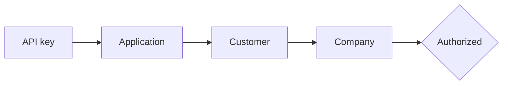

# Customers and companies

This is the tenancy model. Nearly every authorization question resolves to it.

## Customer

A **customer** is one end-user business — the organization whose books you are touching. One per business, not one per user account in your product. Five people from the same firm using your software are one Bizmitra customer.

```http
GET  /api/v1/customers
POST /api/v1/customers
```

Customers hold a token that can be rotated without recreating the customer:

```http
POST /api/v1/customers/{token}/rotate
```

## Company

A **company** is one set of books, corresponding to one company inside TallyPrime. A customer running three legal entities in three Tally companies has three Bizmitra companies.

```http
GET  /api/v1/companies
POST /api/v1/companies
```

The `company_id` returned here is the **Bizmitra Developer Company ID**. It appears in almost every subsequent request, either as a query parameter or as the `X-Bizmitra-Company` header.

::: warning It is not the Tally company GUID
Tally has its own GUID for a company. Bizmitra has its own integer ID. They identify the same books and are not interchangeable. If a call returns `403` or `404` when you are sure the company exists, check which identifier you sent.
:::

## Linking them

The company–customer link is explicit and mutable:

```http
POST   /api/v1/companies/{id}/customer     # attach a company to a customer
DELETE /api/v1/companies/{id}/customer     # detach it
```

Being able to detach matters in real deployments: businesses restructure, an accountant hands a client over, a company gets migrated between customer records. The books stay; the ownership edge moves.

## How authorization actually resolves



Every link in that chain must hold. A `403` on a company endpoint means one of them does not — most often the company was never attached to a customer under your application.

## Disconnecting

```http
POST /api/v1/companies/{id}/disconnect
```

Disconnect severs the company from its Connector pairing. Use it when a customer changes machines, decommissions a server, or offboards.

After disconnecting, the company still exists in Bizmitra with its history intact. It simply has no live route to Tally until it is paired again.

## Modelling advice

Map Bizmitra companies to your own tenancy explicitly. Store `company_id` on your own records rather than looking it up by name at call time — company names change, and matching on them will eventually route a write into the wrong books.

If your product has a concept of "workspace" or "organization", the usual mapping is:

| Your product | Bizmitra |
|---|---|
| Organization / account | Customer |
| Connected accounting entity | Company |
| User | *(no equivalent — Bizmitra does not model your users)* |
