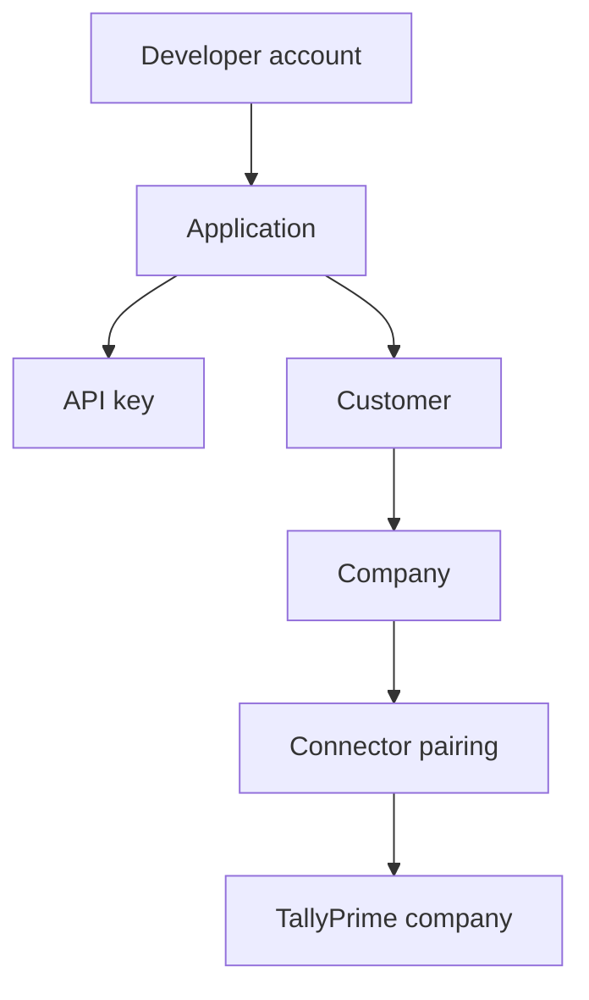

# Platform Concepts

Five ideas carry most of the platform. Getting them straight early saves a lot of debugging later, because most confusing API behaviour turns out to be a misunderstanding of one of them.

## The object hierarchy

| Object | Represents | Scope |
|---|---|---|
| **Developer account** | You | Everything below it |
| **Application** | One product you are building | Keys, branding, connector builds |
| **API key** | A credential | Acts on behalf of one application |
| **Customer** | One end-user business | Belongs to an application |
| **Company** | One set of books | Belongs to a customer |
| **Connector** | One installed Windows agent | Serves one or more companies |

An application with 400 customers, each with two companies, has 800 `company_id` values and somewhere around 400 Connector installations.

## Authorization is relational

A request is authorized when the **application–customer–company** relationship holds. Your key does not grant access to a company; it grants access to the companies belonging to customers belonging to your application.

This is why a `403` on a company endpoint usually means a provisioning mistake rather than a credentials mistake. The key is fine. The link is missing.

## Work is asynchronous

Anything that touches Tally is a **job**. You submit it, Bizmitra queues it, the Connector collects it, Tally executes it, and the result travels back.

The immediate HTTP response tells you the job was accepted. It does not tell you what Tally did. Two different questions, two different answers, sometimes seconds apart.

## Data is normalized, but names are not

Bizmitra normalizes structure — `voucher_kind` is always `sales`, whatever the customer calls it. Bizmitra does not normalize **master names**, because those are the customer's data. A ledger called `Example Customer` is that string, exactly, including the capitalization.

This split is deliberate. Structure is Bizmitra's to define. Names belong to the books.

## Idempotency is your responsibility too

Bizmitra gives you `transaction_id` as a stable correlation key. Using it to avoid duplicate processing on your side is your job, and it is not optional in a system where retries are normal.

## Pages in this section

- **[Applications](/developer/platform-concepts/applications)** — what an application owns, and embedded provisioning.
- **[Customers and companies](/developer/platform-concepts/customers-and-companies)** — the tenancy model and its lifecycle.
- **[Connectors](/developer/platform-concepts/connectors)** — the installed agent, and managing a fleet of them.
- **[Jobs and transactions](/developer/platform-concepts/jobs-and-transactions)** — async execution, status, and idempotency.
- **[Data model](/developer/platform-concepts/data-model)** — the normalized document shape and how it maps to accounting concepts.
