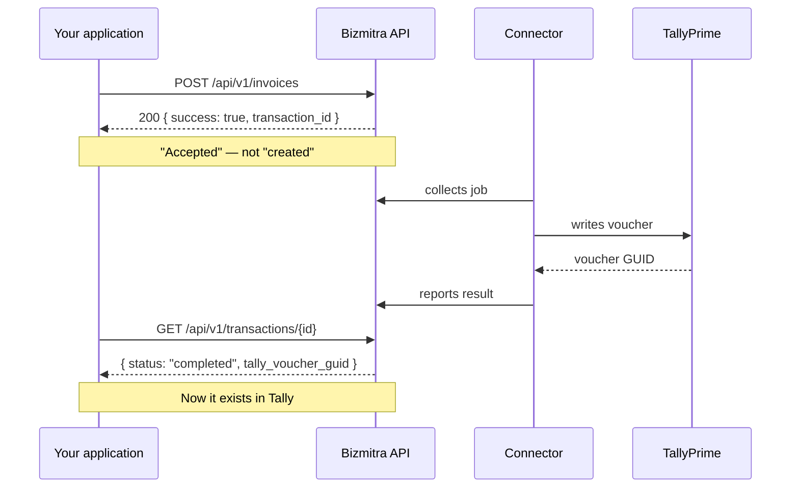

# Jobs and transactions

Everything that touches Tally is asynchronous. Understanding this properly is the difference between an integration that works and one that quietly creates duplicate vouchers.

## Two responses, not one

When you submit a write, you get an answer immediately — but it answers a narrow question.



| Response | Question it answers |
|---|---|
| `POST` response | Did Bizmitra accept and queue this? |
| Transaction status | What did Tally actually do? |

Never tell your user an invoice was created on the strength of the first response. It means the request was well-formed and authorized. Tally may not have run yet, and when it does it may reject the voucher.

## The accepted response

```json
{
  "success": true,
  "transaction_id": "11111111-1111-1111-1111-111111111111",
  "company_id": 123,
  "request_type": "in"
}
```

Persist `transaction_id` against your own record before doing anything else. If your process dies here and you did not store it, you have submitted a write you can no longer track — and retrying blindly is how duplicates happen.

## Checking status

```http
GET /api/v1/transactions/{transaction_id}
GET /api/v1/transactions?company_id={company_id}
```

A completed write (the transaction record is nested under `transaction`):

```json
{
  "success": true,
  "transaction": {
    "job_id": "11111111-1111-1111-1111-111111111111",
    "transaction_id": "invoice-2026-0042",
    "status": "completed",
    "tally_voucher_guid": "22222222-2222-2222-2222-222222222222-00000001",
    "tally_master_id": "335",
    "error_code": null,
    "error_label": null,
    "error_message": null
  }
}
```

::: info Provisional contract
This envelope is the intended contract and is being finalized against production. A successful result will always expose `transaction_id` and the Tally voucher GUID. Field names elsewhere in the envelope may still change before the first stable release.
:::

## Identifiers, and which one to keep

| Identifier | Issued by | Use it for |
|---|---|---|
| `transaction_id` | Bizmitra | Correlating your record with the operation. Your primary key for this. |
| `tally_voucher_guid` | Tally | Pointing at the actual voucher, for later updates |
| `tally_master_id` | Tally | The Tally master ID |
| `tally_alter_id` | Tally | Detecting that a voucher changed in Tally |

Store `transaction_id` and `tally_voucher_guid` on your own record. Without the GUID, a later update has no way to target the existing voucher and will create a second one.

`tally_alter_id` increments when a voucher is edited in Tally. If you are syncing bidirectionally, it is how you notice someone changed the books underneath you.

## Polling

Poll `GET /api/v1/transactions/{id}` with backoff — a couple of seconds initially, widening from there. Do not poll in a tight loop; the Connector may be busy, offline, or waiting on a Tally dialog.

Better: use [webhooks](/developer/webhooks/) and stop polling. Poll only as a reconciliation sweep for transactions whose webhook never arrived.

## Idempotency

Retries are normal. Networks time out, processes restart, queues redeliver. Assume any write may be submitted more than once and design so that it does not matter.

**Writing to Tally**

- Keep an idempotency key of your own on your record.
- Before submitting, check whether that record already has a `transaction_id`. If it does, poll that transaction instead of submitting again.
- On an ambiguous failure — timeout, connection reset — poll before retrying. The job may well have succeeded.
- For updates, always target the stored `tally_voucher_guid`.

**Reading from Tally**

- Treat `transaction_id` as the external key on the pulled voucher.
- If a voucher you have already stored appears again, update it or ignore it. Do not insert.
- Acknowledge only **after** your own transaction commits. Acknowledging first, then failing to save, loses the voucher from the pending queue.

```http
POST /api/v1/pulled-vouchers/ack
```

Acknowledgement is itself idempotent, so acknowledging twice is harmless. Acknowledging too early is not.

## Failure handling

When a transaction fails, the cause is usually in the payload or the target company's masters rather than in Bizmitra.

```json
{
  "success": true,
  "transaction": {
    "job_id": "11111111-1111-1111-1111-111111111111",
    "transaction_id": "invoice-2026-0042",
    "bizmitra_company_id": 123,
    "job_type": "invoice_sync",
    "event_type": "invoice_create",
    "status": "failed",
    "retry_count": 1,
    "max_retries": 5,
    "tally_voucher_guid": null,
    "error_code": "TALLY_IMPORT_FAILED",
    "error_label": "Tally import failed",
    "error_message": "Ledger 'Online Sales' does not exist!",
    "payload": {
      "voucher_number": "INV-0042",
      "voucher_type": "Sales"
    },
    "created_at": "2026-09-20T10:20:00Z",
    "updated_at": "2026-09-20T10:20:08Z",
    "completed_at": null
  }
}
```

`success: true` means the status request succeeded; `transaction.status: "failed"` means the Tally write failed. Use `error_code` for program logic, `error_label` in compact UI, and `error_message` for the useful rejection reason. When Tally returns XML, Bizmitra extracts the meaningful rejection text (for example `LINEERROR`) but does not expose the raw XML envelope, stack traces, credentials, or internal service details.

The show endpoint accepts either the public `job_id` or your own `transaction_id` in `{job}`:

```http
GET /api/v1/transactions/{job}
```

1. Read `error_code` and the sanitized `error_message`.
2. Fix the payload, or create the missing master.
3. Resubmit under your idempotency policy.

Do not build a blind automatic retry for validation failures. A payload Tally rejected once will be rejected identically the second time, and an unbounded retry loop against a live company generates noise for the customer and for you.

### Dashboard visibility

The transaction API is the source of truth for an individual pushed voucher and its failure reason. The connector's Sync History is an operational event feed and is useful for connector, Tally, and report activity, but it is not guaranteed to contain every failed transaction. Poll or reconcile through `GET /api/v1/transactions` for application correctness.

Report freshness is available separately through the company-scoped sync-statistics endpoint:

```http
GET /api/v1/pulled-vouchers/statistics?company_id=42&start_date=2026-09-01&end_date=2026-09-30
```

Its `reports` collection identifies whether each report is enabled, its current status, row count, and latest stored snapshot:

```json
{
  "reports": [
    {
      "key": "stock",
      "label": "Stock summary",
      "enabled": true,
      "capability": "report.stock",
      "status": "available",
      "rows": 54,
      "last_updated_at": "2026-09-20T08:25:00Z"
    },
    {
      "key": "gst",
      "label": "GST",
      "enabled": false,
      "capability": "report.gst",
      "status": "disabled",
      "rows": 0,
      "last_updated_at": null
    }
  ]
}
```

This lets an integration distinguish a fresh report from a disabled or unavailable report without relying on the connector UI. The endpoint is always scoped by `company_id`; it does not aggregate unrelated companies.
