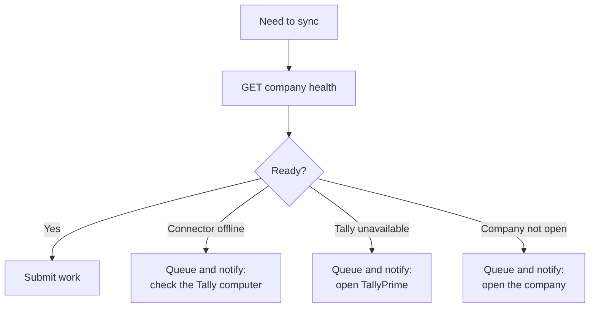

# Company health

```http
GET /api/v1/companies/{company_id}/health
Authorization: Bearer {key_id}:{secret}
Accept: application/json
```

Health answers one question: **can work against this company run right now?**

## Use it as a gate

Call health before any meaningful operation, particularly writes. It costs one cheap request and removes an entire category of confusing failure.

Without it, a write against an offline Connector produces an error that looks like a payload problem. You will read your JSON very carefully before it occurs to you that nobody is home.



## What it reports

Three independent things, each of which can fail on its own:

| Layer | Question | Typical cause of failure |
|---|---|---|
| **Company** | Is this company provisioned and connected? | Never paired, or disconnected |
| **Connector** | Is the agent online? | Machine off, asleep, service stopped, connector disabled |
| **Tally** | Is TallyPrime reachable with the company open? | Tally closed, wrong company open, a modal dialog blocking it |

Distinguish them in your product. They have different fixes and the customer can act on each one — but only if you tell them which it is.

## Surfacing it to your users

The single highest-value thing you can build on top of health is a plain-language connection status in your own UI.

| State | What the user sees |
|---|---|
| Ready | "Connected to Tally" |
| Connector offline | "The Tally computer appears to be offline. Check that it is switched on." |
| Tally unavailable | "TallyPrime is not running. Open it to resume syncing." |
| Company not open | "Open the *Acme Ltd* company in TallyPrime." |
| Not paired | "Finish setup to connect your accounting data." |

Every one of these is a message the customer can act on without contacting anybody. Compare with "Sync failed", which generates a support ticket.

## Polling health

Do not poll aggressively on a timer for every company. At scale that is a lot of requests to learn that most offices are closed at 3am.

Reasonable pattern:

- Check on demand, before work.
- Check when a user opens the relevant screen in your product.
- Check on a slow background schedule for companies you actively sync.
- Back off for companies that have been offline a long time.

## Fleet visibility

For a support view across all customers, the connector endpoints are more useful than per-company health:

```http
GET /api/v1/connectors
GET /api/v1/connectors/{machine}/jobs
```

That gives you the whole fleet and its recent job history in two calls, rather than one health check per company.
