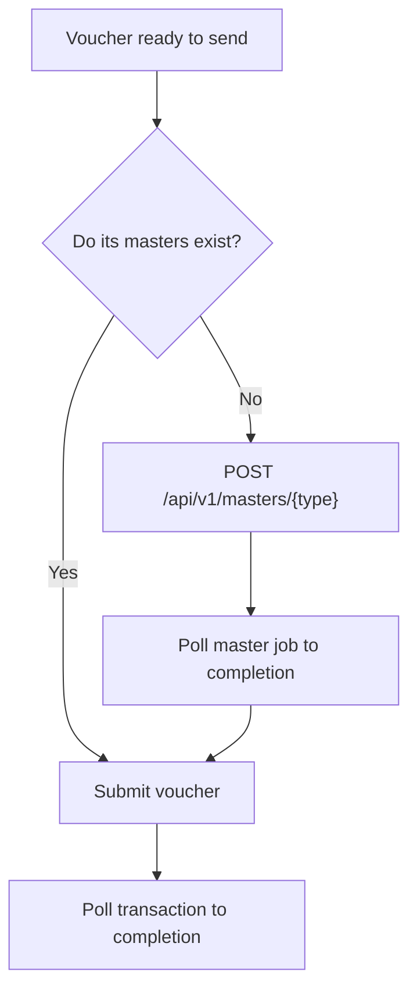

# Masters

**Masters** are the reference data a voucher points at: ledgers, stock items, groups, units, godowns, voucher types. They are created by the customer, in their company, and named however they chose.

## Why they cause most first-integration failures

A voucher payload references masters by name:

```json
{
  "party_ledger": "Example Customer",
  "inventory_entries": [
    { "stock_item": "Example Item", "unit": "Nos", "godown": "Main Location" }
  ],
  "ledger_entries": [
    { "ledger_name": "Sales" }
  ]
}
```

Every one of those strings must match something that exists in the target company, exactly.

The failure is unhelpfully shaped: the request is well-formed, the API accepts it, `success: true` comes back — and the job fails later at the Tally boundary. If you are not checking transaction status, it looks like the write silently vanished.

## Two strategies

**Pre-create masters.** Fine while developing, and fine for a small number of customers you onboard by hand.

**Create them through the API.** Necessary at scale, because you cannot ask 400 customers to create ledgers by hand and get it right.

```http
POST /api/v1/masters/{type}
Authorization: Bearer {key_id}:{secret}
Content-Type: application/json
```

Master creation is asynchronous, like everything else touching Tally:

```http
GET /api/v1/masters/{type}?company_id={company_id}   # list jobs
GET /api/v1/masters/{type}/{job}                     # one job's status
```

## A safe write sequence



Wait for master creation to complete before submitting the voucher that depends on it. Submitting both at once and hoping the ordering works out is a race, and it will resolve differently under load.

## Reading masters back from Tally

`GET /api/v1/masters/{type}` reports **your pushes**. To answer "does this master exist, and how is it configured?" you want the other direction — the masters the Connector has read out of the customer's company:

```http
GET /api/v1/pulled-masters/{type}?company_id={company_id}
Authorization: Bearer {key_id}:{secret}
```

`company_id` is required and is one of your own company `id`s. Page with `limit` (max 200) and `offset`. This endpoint requires the `pull.master` capability on your key and the masters pull enabled for that company; without both, you will see an empty list rather than an error.

Each row carries the master's fields under `payload`:

```json
{
  "success": true,
  "master_type": "voucher_type",
  "total": 24,
  "count": 24,
  "masters": [
    {
      "master_type": "voucher_type",
      "master_name": "Sales Bizmitra",
      "tally_master_guid": "…",
      "request_type": "pull",
      "payload": {
        "kind": "master",
        "master_type": "voucher_type",
        "name": "Sales Bizmitra",
        "fields": {
          "parent": "Sales",
          "reserved_name": "Sales",
          "numbering_method": "Manual",
          "is_active": "Yes",
          "affects_stock": "No"
        },
        "tally": { "guid": "…", "master_id": "…", "alter_id": "914" }
      }
    }
  ]
}
```

### What each type exposes

`payload.fields` varies by type. Every type also carries `name` and `tally.guid` / `master_id` / `alter_id`.

| Type | Fields |
|---|---|
| `group` | `parent`, `is_subledger`, `is_deemed_positive`, `is_revenue` |
| `ledger` | `parent`, `currency`, `opening_balance`, `gstin`, `gst_registration_type`, `mobile`, `email` |
| `currency` | `mailing_name`, `original_name`, `expanded_symbol`, `iso_code`, `decimal_places` |
| `unit` | `is_simple_unit`, `decimal_places`, `base_units`, `additional_units` |
| `godown` | `parent` |
| `stock_group` | `parent`, `base_units`, `is_batchwise`, `closing_balance`, `closing_value` |
| `stock_category` | `parent` |
| `stock_item` | `parent`, `category`, `base_units`, `opening_balance`, `closing_balance`, `closing_value`, `gst_applicable` |
| `voucher_type` | `parent`, `reserved_name`, `numbering_method`, `is_active`, `affects_stock` |

::: warning Values are Tally's, verbatim
Fields are passed through unmodified — no casing, type coercion, or normalization. Booleans arrive as Tally's `"Yes"` / `"No"` strings, not JSON `true` / `false`, and text like `numbering_method` arrives as Tally spells it. Compare case-insensitively rather than against an exact literal.
:::

### Verifying customer setup

This is the endpoint to build an admin or preflight screen on, instead of relying on someone remembering what they configured during onboarding.

The common check is voucher-type numbering. If your integration posts vouchers with numbers you generate, the target voucher type must be on **Manual** numbering — on Automatic, Tally assigns its own number and your reference no longer matches:

```js
const { masters } = await api.get('/api/v1/pulled-masters/voucher_type', {
  params: { company_id: companyId },
})

const type = masters.find(m => m.master_name === postingVoucherType)
const method = type?.payload?.fields?.numbering_method ?? ''

if (method.toLowerCase() !== 'manual') {
  warn(`${postingVoucherType} is set to "${method}" — expected Manual`)
}
```

Two fields make this check more robust than name matching alone:

**`reserved_name`** identifies which built-in type a custom or renamed type derives from. Tally sets it only on its own types (`Sales`, `Purchase`, `Receipt`, …) and keeps it through a rename, so a type the customer renamed `Branch Billing` still reports `reserved_name: "Sales"`. Classify on this, not on the display name.

**`tally.alter_id`** increments whenever the master is altered in Tally. Store it at setup and compare on later reads to flag "someone changed this since we verified it" — rather than only ever seeing current state.

Pair your own records on `tally_master_guid`, as with pushes: it survives renames and re-imports, where the numeric `master_id` is per-company and the name can change.

::: info Freshness
Pulled masters refresh on the Connector's normal sync cycle, not on demand. A master created in Tally seconds ago may not be in this list yet, so treat a miss as "not seen yet" rather than "does not exist" when you are racing a customer's data entry.
:::

## Naming

Master names are the customer's data. Bizmitra does not normalize, trim, or case-fold them, and should not — quietly matching `example customer` to `Example Customer` would eventually post a transaction into the wrong ledger.

Practical consequences:

- Normalize on **your** side before sending, and be consistent about it.
- Watch for trailing whitespace. It is invisible, survives copy-paste, and is a real cause of mismatches.
- Store the resolved master name against your own record once it works, rather than reconstructing it each time.

## Do not create masters casually

Every ledger and stock item you create appears in the customer's books, in their reports, and in front of their accountant. A stray `Customer Name (2)` from a retry is a real annoyance for them.

- Check before creating — see [Reading masters back from Tally](#reading-masters-back-from-tally).
- Make creation idempotent on your side.
- Do not auto-create from unvalidated user input. A typo in your product becomes a permanent ledger in their accounts.

## Group and hierarchy data

Stock groups can be read as a tree:

```http
GET /api/v1/stock-tree
```

Useful for showing the customer their own catalogue structure when mapping your product's items to theirs — which is generally a better onboarding experience than asking them to type names that must match exactly.
