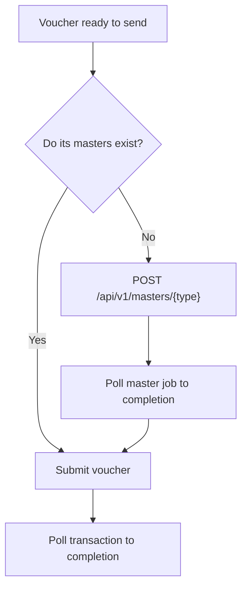

# Masters

**Masters** are the reference data a voucher points at: ledgers, stock items, groups, units, godowns, voucher types. They are created by the customer, in their company, and named however they chose.

## Why they cause most first-integration failures

A voucher payload references masters by name:

```json
{
  "party_ledger": "Example Customer",
  "inventory_entries": [
    { "stock_item": "Example Item", "unit": "Nos", "godown": "Main Location" }
  ],
  "ledger_entries": [
    { "ledger_name": "Sales" }
  ]
}
```

Every one of those strings must match something that exists in the target company, exactly.

The failure is unhelpfully shaped: the request is well-formed, the API accepts it, `success: true` comes back — and the job fails later at the Tally boundary. If you are not checking transaction status, it looks like the write silently vanished.

## Two strategies

**Pre-create masters.** Fine while developing, and fine for a small number of customers you onboard by hand.

**Create them through the API.** Necessary at scale, because you cannot ask 400 customers to create ledgers by hand and get it right.

```http
POST /api/v1/masters/{type}
Authorization: Bearer {key_id}:{secret}
Content-Type: application/json
```

Master creation is asynchronous, like everything else touching Tally:

```http
GET /api/v1/masters/{type}?company_id={company_id}   # list jobs
GET /api/v1/masters/{type}/{job}                     # one job's status
```

## A safe write sequence



Wait for master creation to complete before submitting the voucher that depends on it. Submitting both at once and hoping the ordering works out is a race, and it will resolve differently under load.

## Naming

Master names are the customer's data. Bizmitra does not normalize, trim, or case-fold them, and should not — quietly matching `example customer` to `Example Customer` would eventually post a transaction into the wrong ledger.

Practical consequences:

- Normalize on **your** side before sending, and be consistent about it.
- Watch for trailing whitespace. It is invisible, survives copy-paste, and is a real cause of mismatches.
- Store the resolved master name against your own record once it works, rather than reconstructing it each time.

## Do not create masters casually

Every ledger and stock item you create appears in the customer's books, in their reports, and in front of their accountant. A stray `Customer Name (2)` from a retry is a real annoyance for them.

- Check before creating.
- Make creation idempotent on your side.
- Do not auto-create from unvalidated user input. A typo in your product becomes a permanent ledger in their accounts.

## Group and hierarchy data

Stock groups can be read as a tree:

```http
GET /api/v1/stock-tree
```

Useful for showing the customer their own catalogue structure when mapping your product's items to theirs — which is generally a better onboarding experience than asking them to type names that must match exactly.
