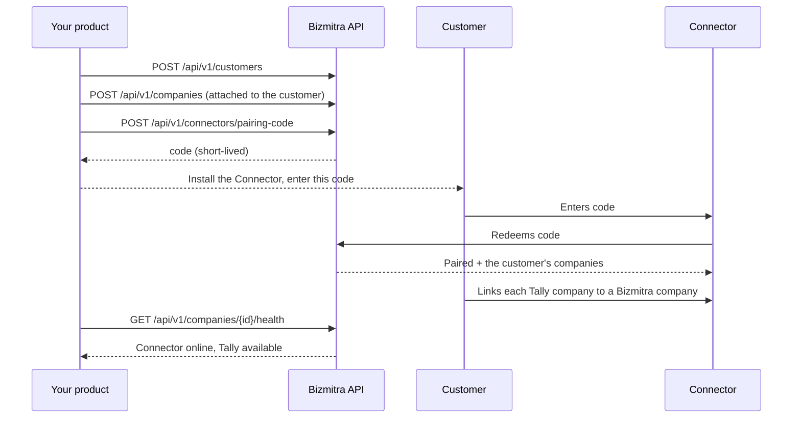

# Pairing a company

Pairing links a customer's Connector installation to the Bizmitra companies you have created for them. Until it happens, a company exists but has no route to any books.

## Pair once, bind many

The model is easy to get wrong, so state it plainly:

- A pairing code is **scoped to a customer**, and authorizes **all** of that customer's companies in your application at once.
- The customer redeems it **once per machine**. The machine then holds its own credentials.
- Companies you create for that customer **later** reach the paired machine automatically. No second code.

A code is therefore an onboarding step, not a per-company operation. If your integration mints one every time a customer adds a company, it is doing unnecessary work and giving the customer a step they do not need.

## Why a code and not a credential

The alternative — handing the customer an API credential — would mean your production secret living on a machine you do not control, typed into a form, and probably emailed at some point. A pairing code is single-purpose, short-lived, and revocable, and it grants nothing beyond establishing one pairing.

It is also the tenant-isolation boundary. The redeemed machine is locked to exactly the company set the code carried, so a Connector can never enumerate another customer's books.

## The flow



## 1. Create the customer and at least one company

A code is minted against a customer, and a customer with no companies has nothing to authorize — that request is rejected. Create the companies first.

See [Customers and companies](/developer/platform-concepts/customers-and-companies).

## 2. Generate a code

```http
POST /api/v1/connectors/pairing-code
Authorization: Bearer {key_id}:{secret}
Content-Type: application/json

{
  "customer_token": "{customer_token}",
  "expires_in": 900
}
```

`customer_token` is the token returned when you created the customer. `expires_in` is optional, in seconds, between 60 and 86400; it defaults to 900.

The plaintext `pairing_code` is returned **once**, here. It is not retrievable afterwards — if you lose it, mint another.

Generate it at the moment the customer is ready to install, not in advance. One generated during a sales call will have expired by the time anyone acts on it.

| Failure | Meaning |
|---|---|
| `403 application_scope_required` | The API key is not associated with an application. Reissue an application-scoped key |
| `404 customer_not_found` | The customer does not belong to this developer |
| `422 customer_has_no_companies` | The customer has no companies in this application. Create one first |

::: warning A code carries one application's companies
The code authorizes only the companies belonging to the application your key is scoped to. A customer whose companies span two applications needs a machine paired per application.
:::

## 3. Get the Connector installed

The customer installs the Connector on the Windows machine that can reach TallyPrime. Point them at the [Tally Connector](/tally-connector/) docs rather than writing your own instructions — [Install and pair](/tally-connector/install-and-pair) is written for exactly this reader.

Make sure they know, before they start:

- Which machine it goes on.
- That TallyPrime needs to be running.
- That the relevant company needs to be open.

## 4. The customer enters the code, then links companies

Redeeming the code pairs the machine. It does **not** decide which Tally company maps to which Bizmitra company — the customer does that in the Connector, by linking each discovered Tally company to one of the Bizmitra companies the code authorized.

That step is local by necessity: only the Connector can see what is open in Tally. It is covered in [Adding and changing companies](/tally-connector/companies).

## 5. Verify

```http
GET /api/v1/companies/{company_id}/health
```

Do not treat pairing as complete because the customer said it worked. Check health. Continue only when the Connector and the Tally company both report available.

See [Company health](/developer/tally/company-health).

## Adding a company to an existing customer

This is the common ongoing operation, and it needs no pairing code.

```http
POST /api/v1/companies                     # create it under the customer
POST /api/v1/companies/{id}/customer       # or attach an existing one
```

Either call grants the company to every machine already paired for that customer. It appears in the Connector's picker, and the customer links it to the right Tally company.

Detaching does the reverse and sync stops:

```http
DELETE /api/v1/companies/{id}/customer
```

::: tip Do not ask a customer to re-pair for this
Re-pairing to add a company is a support burden you do not need to create. If a company is not showing up on a paired machine, check that it is attached to the right customer and belongs to the same application as the key that minted the code.
:::

## Managing outstanding codes

```http
GET  /api/v1/connectors/pairing-codes                # list
POST /api/v1/connectors/pairing-codes/{id}/revoke    # revoke
```

Revoke codes that were issued and never used. An unredeemed code sitting in an old email thread is a loose end, and cleaning them up is cheap.

## Re-pairing

Customers change machines, replace servers, and reinstall Windows. When that happens:

1. Remove the old machine — `DELETE /api/v1/connectors/{machine}`.
2. Generate a fresh pairing code for the customer.
3. Install and pair on the new machine, and link the companies again.
4. Verify health.

Companies keep their `company_id` and their history. Only the route to Tally is rebuilt, so nothing on your side needs to change.

## Common problems

| Symptom | Cause |
|---|---|
| Code rejected | Expired, already used, or revoked. Generate a new one |
| `422` when generating a code | The customer has no companies in this application yet |
| Paired, but health shows Tally unavailable | TallyPrime is closed, or the target company is not open |
| Paired, but a company never appears in the Connector | Not attached to that customer, or created under a different application |
| Data landing in the wrong books | The customer linked the wrong pair in the Connector. Have them unlink and re-link |
| Worked, then stopped | Machine offline or asleep. Check `GET /api/v1/connectors/{machine}` |

That last row is by far the most common, and it is not a fault. Office machines get switched off. Build for it rather than treating each occurrence as an incident.
