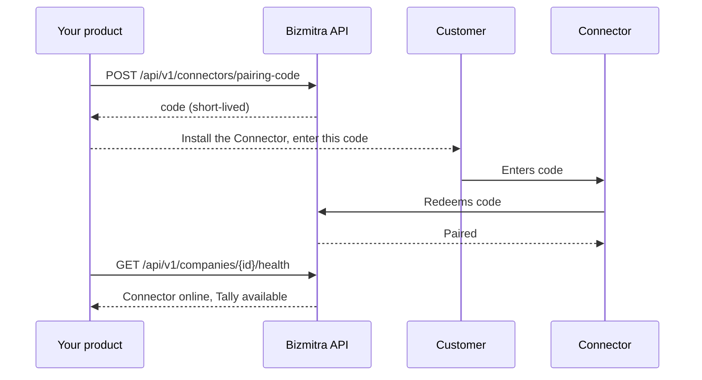

# Pairing a company

Pairing links a Bizmitra company to a real TallyPrime company through an installed Connector. Until it happens, a company exists but has no route to any books.

## Why a code and not a credential

Pairing uses a short-lived code that the customer enters into the Connector.

The alternative — handing the customer an API credential — would mean your production secret living on a machine you do not control, typed into a form, and probably emailed at some point. A pairing code is single-purpose, short-lived, and revocable, and it grants nothing beyond establishing one pairing.

## The flow



## 1. Generate a code

```http
POST /api/v1/connectors/pairing-code
Authorization: Bearer {key_id}:{secret}
Content-Type: application/json
```

Generate it at the moment the customer is ready to install, not in advance. Codes are short-lived by design, and one generated during a sales call will have expired by the time anyone acts on it.

## 2. Get the Connector installed

The customer installs the Connector on the Windows machine that can reach TallyPrime. Point them at the [Tally Connector](/tally-connector/) docs rather than writing your own instructions.

Make sure they know, before they start:

- Which machine it goes on.
- That TallyPrime needs to be running.
- That the relevant company needs to be open.

## 3. The customer enters the code

The Connector redeems the code against Bizmitra and the pairing is established.

## 4. Verify

```http
GET /api/v1/companies/{company_id}/health
```

Do not treat pairing as complete because the customer said it worked. Check health. Continue only when the Connector and the Tally company both report available.

See [Company health](/developer/tally/company-health).

## Managing outstanding codes

```http
GET  /api/v1/connectors/pairing-codes                # list
POST /api/v1/connectors/pairing-codes/{id}/revoke    # revoke
```

Revoke codes that were issued and never used. An unredeemed code sitting in an old email thread is a loose end, and cleaning them up is cheap.

## Re-pairing

Customers change machines, replace servers, and reinstall Windows. When that happens:

1. Disconnect the company if the old pairing is still recorded — `POST /api/v1/companies/{id}/disconnect`.
2. Generate a fresh pairing code.
3. Install and pair on the new machine.
4. Verify health.

The company keeps its `company_id` and its history. Only the route to Tally is rebuilt, so nothing on your side needs to change.

## Common problems

| Symptom | Cause |
|---|---|
| Code rejected | Expired, already used, or revoked. Generate a new one. |
| Paired, but health shows Tally unavailable | TallyPrime is closed, or the target company is not open. |
| Paired to the wrong company | The Connector was pointed at a different Tally company. Disconnect and pair again. |
| Worked, then stopped | Machine offline or asleep. Check `GET /api/v1/connectors/{machine}`. |

That last row is by far the most common, and it is not a fault. Office machines get switched off. Build for it rather than treating each occurrence as an incident.
