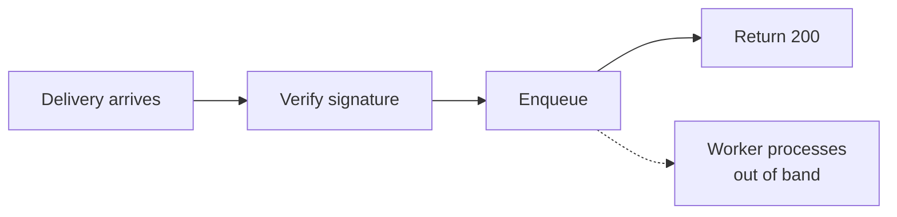
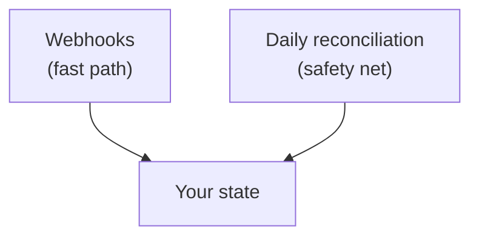

# Delivery and retries

## Respond first, process later

The single most important property of a webhook receiver: **acknowledge immediately, do the work afterwards.**



If you process inline — write to your database, call another service, generate a document — the request stays open for as long as that takes. Exceed the delivery timeout and Bizmitra records a failure and redelivers. You then process the same event twice, having already half-processed it once.

Verify, enqueue, return `200`. Everything else happens in a worker.

## Idempotency

Assume every event may arrive more than once. This is normal behaviour in any at-least-once delivery system, not a fault.

Deduplicate on the webhook's stable `event_id` (or the `X-Bizmitra-Delivery` header):

```js
async function process(event) {
  const seen = await store.exists(event.event_id)
  if (seen) return                 // already handled
  await store.record(event.event_id)
  await handle(event)
}
```

Record the identifier **in the same transaction** as the work, or you will eventually record an event you did not finish handling.

Transaction completion/failure and pulled-voucher arrival are not webhook events today; obtain those through their polling APIs.

## Ordering

Do not assume events arrive in the order they occurred. Retries, parallel delivery, and network conditions all reorder.

Make your handlers order-independent:

- Prefer "set state to X" over "advance to the next state".
- Ignore an event describing a state you have already moved past.
- Use timestamps or `tally_alter_id` to detect a stale update rather than applying it blindly.

A handler that assumes `created` always precedes `updated` will one day receive them the other way round.

## Retries

Failed deliveries are retried with backoff. A delivery fails when your endpoint returns a non-`2xx`, times out, or is unreachable.

Retries with backoff mean a brief outage on your side is usually invisible — the event lands a few minutes later. A long outage may exhaust the retry schedule, which is what the reconciliation sweep below is for.

Inspect what actually happened:

```http
GET /api/v1/webhooks/{id}/deliveries
```

## Status codes to return

| Situation | Return | Why |
|---|---|---|
| Accepted and queued | `200` / `204` | Success |
| Signature invalid | `401` | Do not silently accept forgeries |
| You cannot process it right now | `503` | Signals a retry |
| Payload you do not recognize | `200` | Accept it; log it. Do not fail on new event types. |

That last row follows from [versioning](/developer/api/lifecycle): new event types are added within `v1`. A receiver that errors on an unrecognized type turns a routine additive change into repeated delivery failures.

## Reconciliation

Webhooks are an optimization, not a guarantee. Keep a periodic sweep:



A reasonable daily job:

1. List transactions for each active company since the last sweep.
2. Compare against your own records.
3. Fetch and process anything missing.
4. List unacknowledged pulled vouchers and process any stragglers.

This is a small amount of code, and it converts "an event was lost" from an incident into a delay nobody notices.

## Monitoring

Watch for:

- A rising rate of delivery failures — usually your receiver, not Bizmitra.
- Events accepted but never completing in your queue — a worker problem.
- Signature verification failures — either a rotation gone wrong or someone probing your endpoint.
- Reconciliation regularly finding missed events — your webhook path is not working as well as you think.

That last signal is the valuable one. If the safety net catches something every day, the fast path is broken and you have simply stopped noticing.
