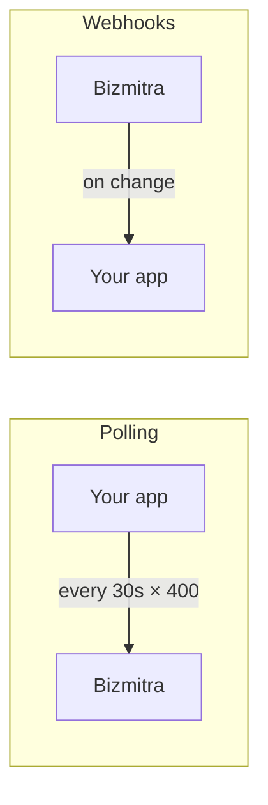

# Webhooks

Webhooks notify your application about Connector, Tally, and company-presence state changes.

::: warning Current webhook scope
Webhooks currently cover only these six events: `connector.online`, `connector.offline`, `tally.started`, `tally.stopped`, `company.linked`, and `company.unlinked`.

Transaction completion or failure and pulled-voucher arrival are **not** webhook events today. Continue to poll the transaction and pulled-voucher APIs for those outcomes.
:::

## Why they matter here

Because Tally work is asynchronous and runs on a machine that is not always available, the alternative to webhooks is polling — and polling this platform is expensive in a specific way.

Consider a partner with 400 companies. Polling each one every 30 seconds is over a million requests a day, nearly all of which learn that nothing changed and that most offices are shut.

With webhooks, you are told when a Connector comes online or goes offline, when Tally starts or stops, and when a company is linked or unlinked. Transaction results and pulled vouchers remain poll-based.



## Pages in this section

- **[Managing endpoints](/developer/webhooks/endpoints)** — creating, testing, and rotating secrets.
- **[Verifying signatures](/developer/webhooks/signatures)** — proving a request came from Bizmitra.
- **[Delivery and retries](/developer/webhooks/delivery)** — what to expect and how to build a reliable receiver.

## The endpoints

```http
GET    /api/v1/webhooks                      # list
POST   /api/v1/webhooks                      # create
GET    /api/v1/webhooks/{id}                 # get
PATCH  /api/v1/webhooks/{id}                 # update
DELETE /api/v1/webhooks/{id}                 # delete
POST   /api/v1/webhooks/{id}/rotate-secret   # rotate signing secret
POST   /api/v1/webhooks/{id}/test            # send a test event
GET    /api/v1/webhooks/{id}/deliveries      # delivery history
```

## The three rules

Everything else is detail. These three are not optional.

**1. Verify the signature.** Your webhook URL is a public endpoint that mutates your data. Anyone who finds it can post to it. See [Verifying signatures](/developer/webhooks/signatures).

**2. Respond fast, process later.** Acknowledge with `2xx` immediately and queue the work. Doing real processing inside the request risks a timeout, which triggers a redelivery, which you then process twice.

**3. Be idempotent.** Assume every event may arrive more than once. Deduplicate on `event_id` (or the `X-Bizmitra-Delivery` header).

## What webhooks do not replace

Keep a reconciliation path. Deliveries can fail, your receiver can be down for an hour, an event can be lost at either end.

Webhooks do not report transaction outcomes or voucher arrivals. Poll the transaction API until each push reaches a terminal state, and keep polling and acknowledging the pulled-voucher API for Tally-originated vouchers.
