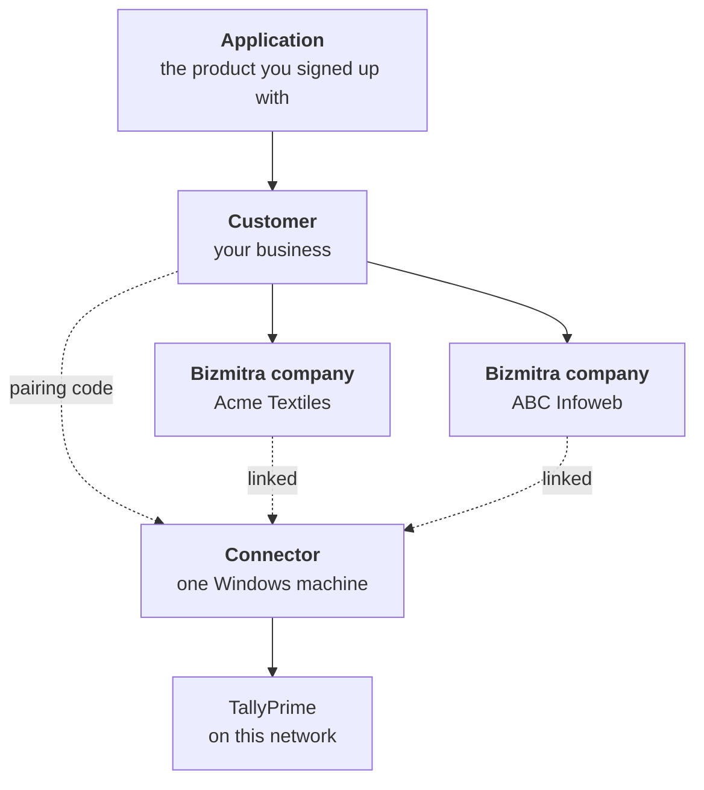
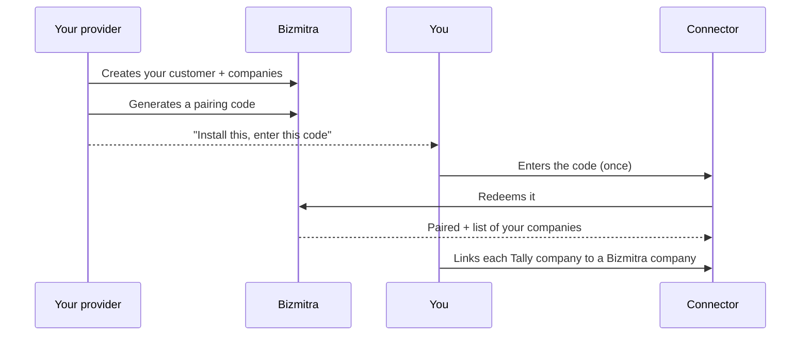

# How it all fits together

Almost every confusing moment with the Connector comes from one of two things: not knowing that **"company" means two different things**, or assuming the app is tied to a single company.

Five minutes here saves a lot of support calls.

## The four pieces

| Piece | What it is | Who creates it |
|---|---|---|
| **Application** | The product you are connecting Tally to | Your software provider |
| **Customer** | Your business, as one record | Your provider |
| **Bizmitra company** | One set of books, matching one Tally company | Your provider |
| **Connector** | One Windows installation | You, once per machine |

## The two kinds of "company"

This is the distinction that matters.

| | **Tally company** | **Bizmitra company** |
|---|---|---|
| Lives in | TallyPrime, on your machine | Bizmitra, in the cloud |
| Identified by | Company name, GUID, and **Company #** | A name in your provider's system |
| Created by | Whoever set up your Tally | Your software provider |
| Shown in the Connector under | **Companies** | The *"Link to … company"* picker |

Syncing happens only once you **link** the two — you tell the Connector "this Tally company's books belong in that Bizmitra company."

::: warning "Company 60" is a Tally number
The **Company #** column in the Connector is Tally's own number for a company in its company list. It is not a Bizmitra identifier, it is not an account number, and it means nothing outside your Tally installation. Two different businesses can both have a company 60.
:::

## One install, many companies

The Connector is paired to **you**, not to a company.

- You install it **once per machine**.
- You enter a pairing code **once**, when you first set it up.
- After that you link, unlink, and re-link as many companies as you like — **without a new code and without a new installation**.

This is the single most common misunderstanding. Adding a second company to a machine that is already paired needs no new download, no new `.exe`, and no new pairing code.

::: tip The app is one universal program
Even a Connector branded with your provider's name is the same executable carrying a small branding file alongside it. Nothing about it is generated per company or per customer, so there is nothing to regenerate when your company list changes.
:::

## What the pairing code actually does

The code you type in at setup is short-lived and single-use. Redeeming it does two things:

1. **Registers this machine** to your account, and stores a long-lived token so the code is never needed again.
2. **Authorizes the machine** for the companies your provider has put under your customer record — and only those. A Connector can never see another business's books.

## When a new company is added later

Your provider creates the new Bizmitra company under your customer record. It is **granted to your already-paired machines automatically** — no re-pairing.

On your side it simply appears in the picker the next time you go to link a company. See [Adding and changing companies](/tally-connector/companies).

## The two lists, and why something is missing

The Connector shows you two separate lists, and they fail for different reasons. Knowing which list is empty tells you who fixes it.

| List | Where it comes from | If a company is missing |
|---|---|---|
| Tally companies (**Companies** screen) | Read live from TallyPrime | The company is not open in Tally, or Tally is not running |
| Bizmitra companies (the link picker) | Your provider's records | Your provider has not created it, or not attached it to your customer |

The first is yours to fix. The second is a one-line request to your provider.

## Next

- [Install and pair](/tally-connector/install-and-pair)
- [Adding and changing companies](/tally-connector/companies)
