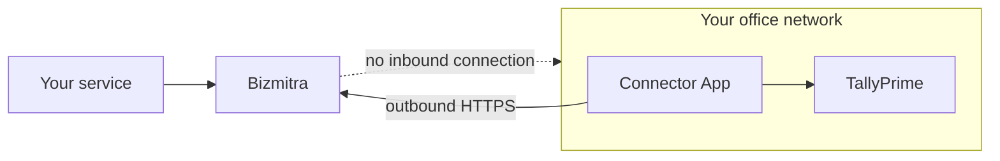

# Tally Connector

The Bizmitra Connector App is a small Windows application that lets an authorized service exchange data with TallyPrime — without exposing Tally to the internet.

This section is for the people who **install and run** the Connector: business owners, accountants, and the support staff who help them. It assumes no interest in the API.

::: tip Integrating with Bizmitra as a developer?
The API-level detail is in the [Developer Platform](/developer/) section — [The Connector App](/developer/tally/connector-app), [Pairing](/developer/tally/pairing), [Company health](/developer/tally/company-health) and [Managing connectors](/developer/platform-concepts/connectors).
:::

## Start here

| Page | What it answers |
|---|---|
| [How it all fits together](/tally-connector/how-it-works) | The app, the pairing code, and the two kinds of "company" |
| [Install and pair](/tally-connector/install-and-pair) | Getting it running the first time |
| [Adding and changing companies](/tally-connector/companies) | Add a company, swap one for another, stop syncing one |
| [Sync settings](/tally-connector/sync-settings) | Business Hours, Pause, and how hard the Connector works Tally |
| [Troubleshooting](/tally-connector/troubleshooting) | Tally freezing, nothing syncing, wrong data |
| [FAQ](/tally-connector/faq) | The questions that come up most |

## What it does

The Connector runs on a Windows computer that can reach TallyPrime. It keeps an outbound connection to Bizmitra, collects work it has been authorized to perform, carries it out in Tally, and reports the result back.

## What it needs

| | |
|---|---|
| **Computer** | Windows, able to reach TallyPrime over your network |
| **TallyPrime** | Running, with the relevant company open |
| **Internet** | An ordinary outbound connection |
| **Firewall changes** | None |

**Nothing needs to be opened up.** The Connector reaches out to Bizmitra; Bizmitra never connects into your network. No port forwarding, no static IP, no incoming firewall rule.

## Where to install it

On the computer that runs TallyPrime, or another on the same network that can reach it.

If Tally runs on a server, install the Connector there rather than on a workstation someone switches off at the end of the day.

**One install per machine, not per company.** A single Connector syncs as many Tally companies as you link to it. See [How it all fits together](/tally-connector/how-it-works).

## While it is running

The Connector needs the computer switched on and TallyPrime open for syncing to happen. If either stops, syncing pauses and resumes automatically once things are back.

This covers most of what goes wrong:

| What you see | What to check |
|---|---|
| Nothing is syncing | Is the computer switched on and awake? |
| Connected, but no data | Is TallyPrime running? |
| Connected, but the wrong data | Is the right company open in Tally? |
| Stopped after an office move | The computer may have a new network connection |

More detail in [Troubleshooting](/tally-connector/troubleshooting).

## Getting help

Contact whoever provided your Bizmitra connection — usually the software company whose product you are connecting to Tally. They can see whether your Connector is online and what it has been doing.

For anything else, [contact Bizmitra](https://bizmitra.io/contact).
