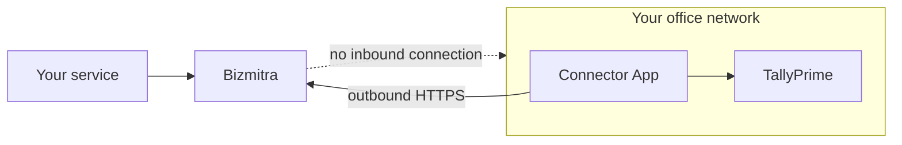

# Tally Connector

The Bizmitra Connector App is a small Windows application that lets an authorized service exchange data with TallyPrime — without exposing Tally to the internet.

::: info Documentation in progress
This section is being written for the people who install and run the Connector. Installation, pairing, and troubleshooting guides are coming shortly.

If you are a developer integrating with the Bizmitra platform, the technical detail you need is in the [Developer Platform](/developer/) section today:

- [The Connector App](/developer/tally/connector-app) — what it is and what it requires
- [Pairing a company](/developer/tally/pairing) — connecting a company to Tally
- [Company health](/developer/tally/company-health) — checking readiness
- [Managing connectors](/developer/platform-concepts/connectors) — the fleet API
:::

## What it does

The Connector runs on a Windows computer that can reach TallyPrime. It keeps an outbound connection to Bizmitra, collects work it has been authorized to perform, carries it out in Tally, and reports the result back.

## What it needs

| | |
|---|---|
| **Computer** | Windows, able to reach TallyPrime over your network |
| **TallyPrime** | Running, with the relevant company open |
| **Internet** | An ordinary outbound connection |
| **Firewall changes** | None |

**Nothing needs to be opened up.** The Connector reaches out to Bizmitra; Bizmitra never connects into your network. No port forwarding, no static IP, no incoming firewall rule.

## Where to install it

On the computer that runs TallyPrime, or another on the same network that can reach it.

If Tally runs on a server, install the Connector there rather than on a workstation someone switches off at the end of the day.

## While it is running

The Connector needs the computer switched on and TallyPrime open for syncing to happen. If either stops, syncing pauses and resumes automatically once things are back.

This covers most of what goes wrong:

| What you see | What to check |
|---|---|
| Nothing is syncing | Is the computer switched on and awake? |
| Connected, but no data | Is TallyPrime running? |
| Connected, but the wrong data | Is the right company open in Tally? |
| Stopped after an office move | The computer may have a new network connection |

## Coming to this section

- Installation, step by step
- Pairing with a code
- Troubleshooting
- Updating the Connector
- Uninstalling

## Getting help

Contact whoever provided your Bizmitra connection — usually the software company whose product you are connecting to Tally. They can see whether your Connector is online and what it has been doing.

For anything else, [contact Bizmitra](https://bizmitra.io/contact).
